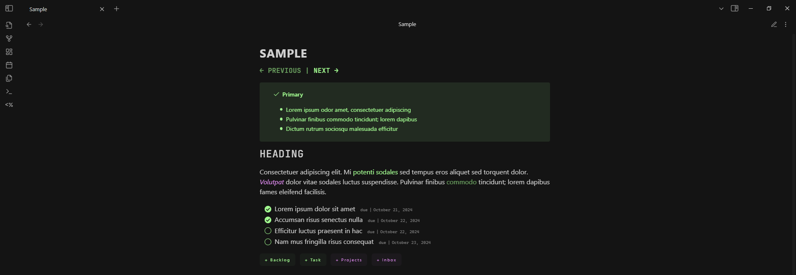
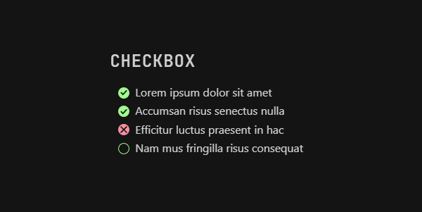
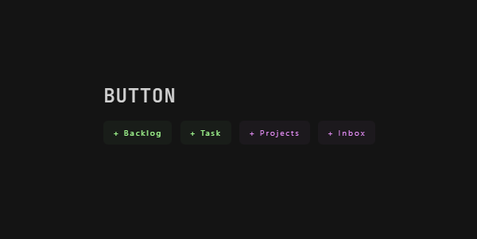
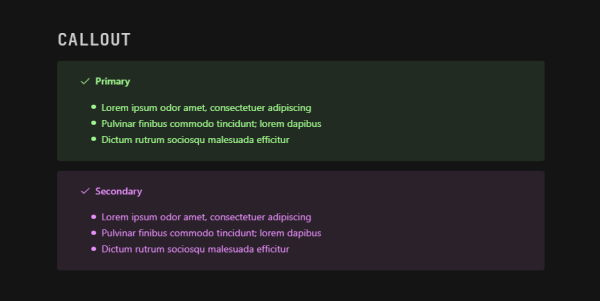
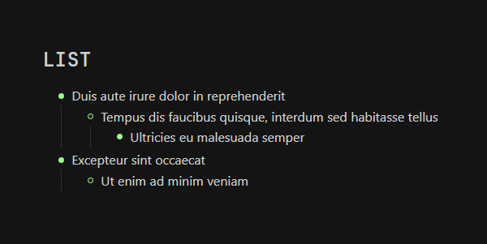
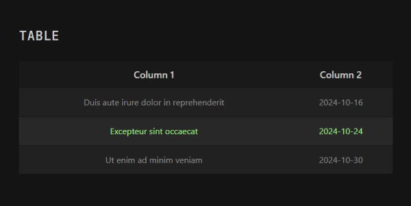
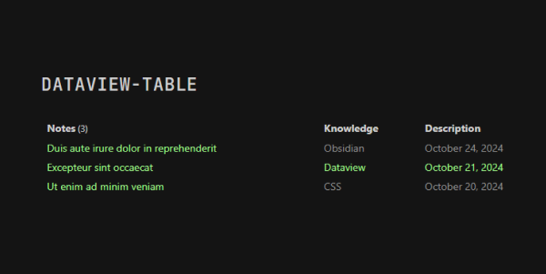
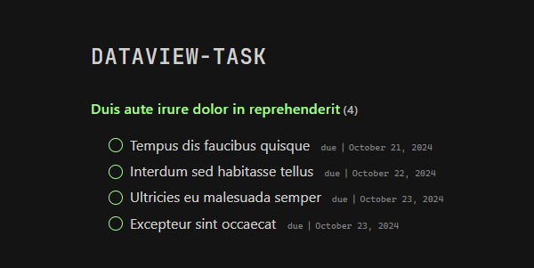
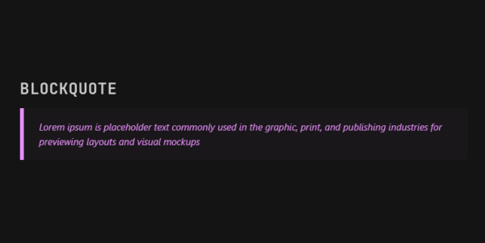
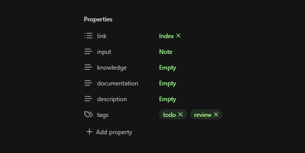

An obsidian theme inspired by the vibrant colors of the aurora borealis, illuminating the night.

A minimalist theme with two main colors that allows you to stay focused and create a productive workspace.

⚠️ **Building in public**: This theme is currently in its initial phase, and what is published is only its first version, far from the desired result. I'll be working to include improvements and more features.

## Features
- Dark and light mode
- Checkbox
- Buttons
- Callouts
- List
- Table
- Custom [Dataview](https://github.com/blacksmithgu/obsidian-dataview) styles
- Blockquote
- Properties
- Canvas
- Seven syntax highlighting available
- [Style Settings](https://github.com/mgmeyers/obsidian-style-settings) enabled

## Preview

### Dark


### Light


### Checkbox

```
- [x] Lorem ipsum dolor sit amet
- [x] Accumsan risus senectus nulla
- [c] Efficitur luctus praesent in hac
- [ ] Nam mus fringilla risus consequat
```

### Buttons

```html
<button class="primary">+ Backlog</button>
<button class="primary">+ Task</button>
<button class="secondary">+ Projects</button>
<button class="secondary">+ Inbox</button>
```

### Callout

```
> [!primary] Primary
> - Lorem ipsum odor amet, consectetuer adipiscing
> - Pulvinar finibus commodo tincidunt; lorem dapibus
> - Dictum rutrum sociosqu malesuada efficitur

> [!secondary] Secondary
> - Lorem ipsum odor amet, consectetuer adipiscing
> - Pulvinar finibus commodo tincidunt; lorem dapibus
> - Dictum rutrum sociosqu malesuada efficitur
```

### List


### Table


### Dataview




### Blockquote


### Properties


## Settings

You can use [Style Settings](https://github.com/mgmeyers/obsidian-style-settings) to adjust the following theme variables:
- Colors
- Backgrounds
- Fonts
- Syntax highlighting

## Contributing

Your contributions are welcome. If you find a bug or consider that there is something that can be improved, you are more than welcome to make a pull request or report it in issues.

## Credits

It would be unfair to omit the incredible [Obsidian](https://obsidian.md/) community. Their [Discord channel](https://obsidian.md/community) has allowed me in recent months, in addition to falling in love with the application, to teach me everything I needed to create this theme and, above all, to inspire me.

Thanks to everyone who has answered my questions.
